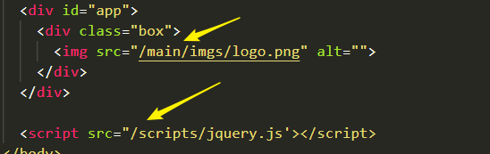
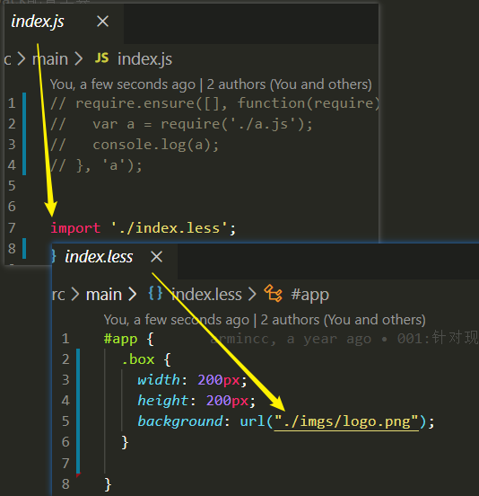
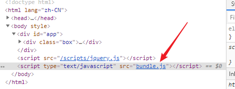
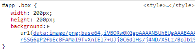
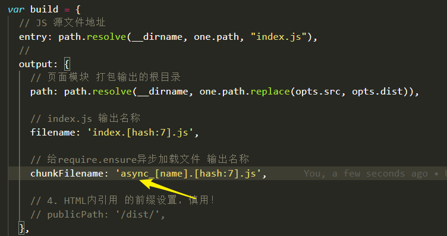
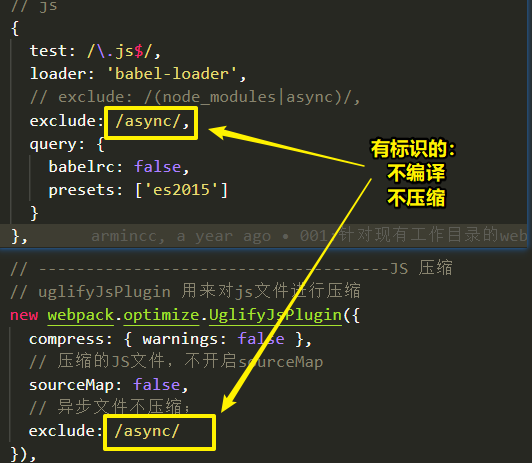
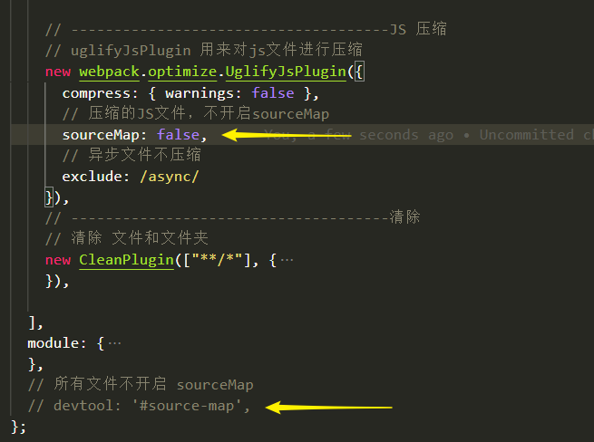
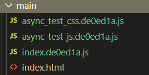

# cli-wpkEpr-mpa


## 基础-知识

### webpack

* 只认识JS，所以只能把所有JS相关引用打包在一起；
* loader：帮助webpack处理其他非JS的文件；
* dev模式
  * `dev：webpack-dev-server`
  * 编译的后文件没有真实的存在于文件中，存在于内存上；
  * 特点：**不考虑各种输出，只是依赖编译，loader处理正确即可，编译速度快；**
* build模式：
  * `build：webpack`
  * 编译后的文件真实的存在于文件中；
  * 特点：考虑各种文件的输出，配置插件，hash值等，编译速度慢；

### 先前思路

1. 使用`browser-sync`以编译为的`webapp`文件夹目录为根目录，启动静态服务；

2. 使用第三方包`watch`监听`src_webapp`下的文件；
3. 文件被修改，执行一次编译：`process.exec('npm run build',function(){..}`
4. 编译完成后，静态服务重新刷新；

* 实现如下：

```js
var process = require('child_process');
var path = require('path');
var gulp = require('gulp');
var watch = require('watch')
  // 服务器
var browserSync = require('browser-sync').create();


// 启动服务器
browserSync.init({
  notify: false,
  server: path.resolve(__dirname, './webapp/'),
  index: './index.html',
  port: 1011,
  logConnections: true
});


// 只能监听 删除 和 修改，
// 新增的文件监听不了；
// gulp
//   .watch(path.resolve(__dirname, './webapp/**/*.*'))
//   .on("change", function() {
//     browserSync.reload();
//   });

watch
  .watchTree(path.resolve(__dirname, './src/'),
    function(f, curr, prev) {
      // 
      process.exec('npm run build', function(error, stdout, stderr) {
          if (error !== null) {
            console.log('exec error: ' + error);
          }
          console.log(stdout);
          // reload();
          browserSync.reload();
        });
    });
```

* 该思路的好处是像gulp一样使用webpack，只关注如何编译输出，也可实现。**但是开发编译速度太慢；**这也是为什么官方给两种模式；
* 通过此次试验，可得出与webpack与gulp在流程上的区别：
  * gulp侧重于流式操作，哪个文件发生改变，单独编译哪个文件，速度很快；**但是不能把文件相互的依赖当做模块处理；**
  * **webpack侧重于文件之间作为模块相互使用，打包输出；**


## 基础-dev

### version

* `webpack-dev-server@2.1.0-beta.0`

* `package.json：dev: "set NODE_ENV=development&& webpack-dev-server --open --inline"`
  * `--inline` 内联模式


### config

* 配置信息：

```js
var dev = {
    entry: `${opts.src}index.js`,
    plugins: [
        new HtmlWebpackPlugin({
            template: `${opts.src}index.html`, // 模版文件
        }),
    ],
    devServer: {
        port: 1010,
        contentBase: "./src_webapp/",
        historyApiFallback: true, // 静态资源目录
        hot: false,  // 热加载
        inline: true, // cli模式，内联模式
        noInfo: true,
        proxy: {  // 配置代理
            "/api": "http://localhost:1011"
        }
    },
    module: {
        rules: [
            // 
            {
                test: /\.js$/,
                loader: 'babel-loader',
                exclude: /node_modules/,
                query: {
                    babelrc: false,
                    presets: ['es2015']
                }
            },
            {
                test: /\.css$/,
                loader: 'style-loader!css-loader'
            },
            //
            {
                test: /\.less$/,
                loader: 'style-loader!css-loader!less-loader'
            },
            // fonts
            {
                test: /\.(eot|svg|ttf|woff|woff2)$/,
                loader: 'url-loader',
            },
            // img
            {
                test: /\.(png|jpe?g|gif|svg)(\?.*)?$/,
                loader: 'url-loader',
            }
        ]
    },
    devtool: '#source-map',  // JS调试地图；
};
```


### log解读

```json
// 服务运行在端口
Project is running at http://localhost:1010/

// 服务输出服务从 / 根目录开始
webpack output is served from /

// 静态资源目录在 ./src 【配置】
Content not from webpack is served from ./src

// 任何找不到路径 返回 /index.html
404s will fallback to /index.html
```


### html：引入

* index页面中的引入需要以**绝对路径**引入；
  * JQ、img图片
  * 注意 引入JQ的位置：<body>里的最下面；
  
  


### JS：引入

* less在js里引入less文件；

* less里面对图片的引入为**相对路径**；




### 配置：指定html

* 指定index.html，不指定的话，默认会找当前webpack.conf.js所在目录下的index.html

```js
  plugins: [
    new HtmlWebpackPlugin({
      template: `${opts.src}index.html`, // 模版文件
    }),
  ],
```

* 指定入口js文件：dev模式在内存上生成bundle.js，在页面内（HtmlWebpackPlugin的作用）；



* CSS内的图片及字体文件等，在测试阶段读取为base64位；




### 配置：热加载?

* 命令行开启及配置：

```js
// package.json
"scripts": {
    "dev": "cross-env NODE_ENV=development webpack-dev-server --open --inline --hot",
},
  
// 配置
plugins: [
    // 热加载插件
    new webpack.HotModuleReplacementPlugin()
],
devServer: {
   hot: true,  // 命令行开启，且JS配置HMR之后可以选择开启 ，热加载
},
```

* 问题：热加载生效后，修改 less 与 JS 页面会重新加载，修改HTML页面不会重新加载，也没有热加载；
* 解决：不配置热加载；


### 配置：proxy&&sourceMap

```js
    devServer: {
        proxy: {  // 配置代理
            "/api": "http://localhost:1011"
        }
    },
    devtool: '#source-map',  // JS调试地图；
```


## 基础-build

### version

* `webpack@2.1.0-beta.25`

* `package.json：build: "set NODE_ENV=production&& webpack --progress --hide-modules"`

  * `--watch`：开启实时编译；

  

### 配置：entry&&output

```js
  // index.js 源文件地址
  entry: `${opts.src}index.js`,
  output: {
    // 所有文件打包输出的根目录
    path: path.resolve(__dirname, build_base_str),

    // index.js 输出名称
    filename: 'index.[hash:7].js',

    // 给require.ensure异步加载文件 输出名称
    chunkFilename: '[name].[hash:7].js',

    // 4. HTML内引用 的前缀设置，慎用！
    // publicPath: '/dist/', 
  },
```


### 配置：HTML

* 输出地址为 `output.path`

```js
// ------------------------------------HTML
new HtmlWebpackPlugin({
    // HTML 源文件地址
    template: `${one}index.html`,
   
    // HTML 输出名字，
    filename: 'index.html',
}),
```

* html里面以**绝对路径**引入的文件，不会被打包过来，需要手动复制；


### 配置：css&&less

* **webpack侧重于打包，所以为什么要把CSS文件单独输出呢？！**
* 所以，配置loader，打包在index.js内；

```js
module: {
    rules: [
      //
      {
        test: /\.less$/,
		//
        use: [
          'style-loader',
          'css-loader',
          // 
          {
            loader: 'postcss-loader',
            options: {
              ident: 'postcss',
              plugins: [
                require('autoprefixer')({
                  browsers: ['last 2 versions', '>1%', 'Firefox >= 20', 'Chrome >=40']
                }),
              ]
            }
          },
          'less-loader'
        ]
      },
        
    ]
  },
```


### 配置：img&&font

* 和dev模式不同，图片可以限制文件大小，和需要配置输出文件名
* 输出地址为 `output.path`

```js
      // fonts
      {
        test: /\.(eot|svg|ttf|woff|woff2)$/,
        loader: 'url-loader',
        query: {
          // 限制（小于就加载为base64位串）
          limit: 32 * 1024,
          // 字体 输出名称
          name: `${opts.font}/[name].[hash:7].[ext]`
        }
      },
      // img
      {
        test: /\.(png|jpe?g|gif|svg)(\?.*)?$/,
        loader: 'url-loader',
        query: {
          // 限制（小于就加载为base64位串）
          limit: 32 * 1024,
          // 图片 输出名称
          name: `${opts.img}/[name].[hash:7].[ext]`
        }
      }
```


### 配置：index.js

* 输出配置：

```js
  // index.js 源文件地址
  entry: `${opts.src}index.js`,
  output: {
    // 所有文件打包输出的根目录
    path: path.resolve(__dirname, build_base_str),

    // index.js 输出名称
    filename: 'index.[hash:7].js',
  },
```

* 语法编译：

```js
// js
{
  	test: /\.js$/,
	loader: 'babel-loader',
	// exclude: /(node_modules|async)/,
	exclude: /async/,
	query: {
		babelrc: false,
		presets: ['es2015']
	}
}
```

* 混淆压缩：

```js
// -------------------------------------JS 压缩
// uglifyJsPlugin 用来对js文件进行压缩
new webpack.optimize.UglifyJsPlugin({
    compress: { warnings: false },
    // 压缩的JS文件，不开启sourceMap
    sourceMap: false,
    // 异步文件不压缩；
    exclude: /async/
}),
```


### 配置：异步加载？

* 场景：某个功能模块，只是在该页面地方需要第三方JS插件（有可能带着JS和CSS），其他页面不需要；异步加载；
* 问题：把异步加载写在点击函数的里面，只会异步加载一次，下次点击不再生效；
* 所以写在 点击函数的外面，在`index.js`内的异步加载：

```js
// 异步加载
require.ensure([], function(require) {
  require('./test.css');
  var obj = require('./test.js');


  $('#box')
    .on("click", function() {
      console.log("函数内部的执行");

      obj.fn();
    });

}, 'test_js');
```

* **思考：但是HTML页面加载后，会异步加载第三方，感觉和同步加载一样！所以可以直接就在页面中引入就可以了！第三方就放入libs**

* 为什么是CSS和JS：因为一般使用的插件都是别人写好的，就是CSS和JS文件，不可能出现less文件；

* **需要注意的问题：!!!**

  * 别人写好的CSS和JS文件，一般都已经是被编译和被压缩后的文件；
  * 所以我们在异步引入之后，**不需要编译和压缩**，配置输出的文件名为特殊标识：

  

  * **那么在编译时，就要排除这样的标识，不能被编译。同理：混淆压缩；**

  


### 配置：无sourceMap

* 不开启：




## copy

* `*"fs-extra"*: "^8.1.0",`

* 无论dev还是build模式，都可以把没有办法用模块的方式引入的JS文件直接复制：

```js
// --------------------用于复制文件，无论是什么模式
var fs = require('fs-extra');

// 页面引入的文件的复制
fs.copy(
    path.resolve(__dirname, opts.src, opts.copy),
    path.resolve(__dirname, opts.dist, opts.copy), )
  .then(function() {
    console.log(`${opts.src}/${opts.copy} 所有文件复制成功`);
  });
```


## 前言

- 构建：
  - `webapck@2.1.0-beta.25`
  - `webpack-dev-server@2.1.0-beta.0`
  - `express@4.16.4`  `mongoose@5.3.13`

- **场景：**
  - 前端：纯JS项目（例如：`JQ、vue`非脚手架项目）`MPA`多页面应用；
  - 后台为：
    - 联调公司后台；
    -  `express`全栈开发；
- 特点：
  - 前端：
    - **需指定测试目录地址；**
    - 前端页面修改后，自动刷新；
    - 前端新增文件后，需要手动重启；
    - 支持与公司后台联调；
  - 后端：支持全栈开发时，后台服务修改后，自动重启；


## cli

```json
  "scripts": {
    // 前端开发，api可以和后台联调
    "web_dev": "set NODE_ENV=development&& webpack-dev-server --open --inline",
      
    // 前端打包
    "web_build": "set NODE_ENV=production&& webpack --progress --hide-modules",
      
    // 与前端形成简单联调测试，真实联调不开启
    "api_proxy": "set NODE_ENV=api_simple&& node ./api_server/app_auto.js",
      
    // 后台开发 热启动
    "api_only": "set NODE_ENV=api_only&& node ./api_server/app_auto.js",
     
    // 前后端全部完成
    "all": "node ./api_server/app.js"
  },
```


## 前端：目录结构

- `webapp`  【打包编译后的目录，该目录结构必须与src_webapp保持一致，否则会有文件引用路径错误】
  - `moudles` 【所有的业务模块放入这个文件夹下面】
    - `main/` 【一个文件夹作为一个业务功能模块】
      - `imgs `【该模块的图片】
      - `index.html`
      - `index.less`
      - `index.js` 【把本功能模块需要的AP 配置 到 JS内部】
      - `test_data.js` 【模拟测试数据，用于和后台格式约定】
      - `test.js`【第三方插件JS】
      - `test.css`【第三方插件css】
  - `scripts` 【项目中所有业务需要的公共的JS文件】
    - `common` 【公司自己维护的公共文件】
    - `libs` 【业务需要的其他JS文件，例如JQ，VUE等】
  - `index.html` 【项目的入口HTML文件】


## 前端：webpack.config.js 配置

```js
// 基本配置
var conf = {
  // 前端测试模式下的端口
  dev_port: 1010,

  // 本地后台1011 打包后/测试时 被代理的端口
  api_port: 1011,
};


// dev需求：
// 1.指定需要测试业务模块地址：
var one = {
  path: './src_webapp/main/',


  // ****约定：该模块下，dev引用和build的输出 目录名称：
  imgs_dir: 'imgs',
  fonts_dir: 'fonts',
  // 异步文件的标识 async
};

// 配置项
var opts = {
  // dev模式下，源文件夹名称；
  src: "src_webapp",

  // 依赖文件的目录名称，需要手动复制
  copy: "scripts",

  // 打包的目录名称
  dist: 'webapp',
};
```


## 前端：npm run web_dev

* 内部执行核心：前端dev模式，代理开启；
* 适用场景：
  * **页面功能HTML+CSS+JS 页面功能开发**
  * 与后台联调

```js
  devServer: {
    // dev 端口
    port: conf.dev_port,
    contentBase: path.resolve(__dirname, opts.src),
    historyApiFallback: true, // 静态资源目录
    hot: false,
    inline: true, // cli 模式，内联模式
    noInfo: true,
    // 代码端口
    proxy: {
      "/api": 'http://localhost:' + conf.api_port,
    }
  },
```


## 前端：npm run web_build

* 内部执行核心：
  * 执行webpack.config.js 的build配置；
  * 单独输出到指定业务目录下，
  * 没有sourceMap
  * 文件有hash值；
  * css打包在JS内；
  * 图片如果小于限制在JS内（base64）




## 后台：目录结构

- `api_server`  【后台的根目录】
  - `collection` 【前端的业务模块对应后台的数据库模型】
    - `xx_model.js` 【具体的数据库模型】
  - `moudles` 【前端的业务模块对应后台的设计的API文件】
    - `xx_api.js` 【每个模块对应设计的api文件】
  - `app_auto.js` 【测试模式入口文件，根据模式进入测试不同的文件】
  - `app_simple.js` 【前端联调时，简单地充当后台的服务】
  - `app.js`【后台开发时或者完成后，入口文件】
  - `conf.js`【后台的配置文件】


## 后台：`app_auto.js`

```js
var nodemon = require('gulp-nodemon');
var path = require('path');

var src;
var env = process.env.NODE_ENV;
switch (env) {
  // 简单的与前端联调
  case "api_simple":
    console.log("与前端简单联调测试 热开启");
    src = path.join(__dirname, './app_simple.js');
    break;

    // 后台开发模式
  case "api_only":
    console.log("后台开发 热启动");
    src = path.join(__dirname, './app.js');
    break;
};

nodemon({
  script: src,
  ignore: [
    path.join(__dirname, '../src_webapp/'),
    path.join(__dirname, '../webapp/'),
    path.join(__dirname, '../gulpfile.js'),
    path.join(__dirname, '../cmd.js'),
  ],
  env: { 'NODE_ENV': 'development' }
});
```


## 后台：npm run api_proxy

- 前端开发完成后，需要与后台进行简单的联调；
- 若后台此时不能配合，该功能可简单的进行联调；


## 后台：npm run api_only

- 执行核心：后台热启动开发，该模式完全是后台开发；


## 后台：npm run all

- 执行核心：前端开发完成，后台开发完成，在服务器上部署启动服务时；

